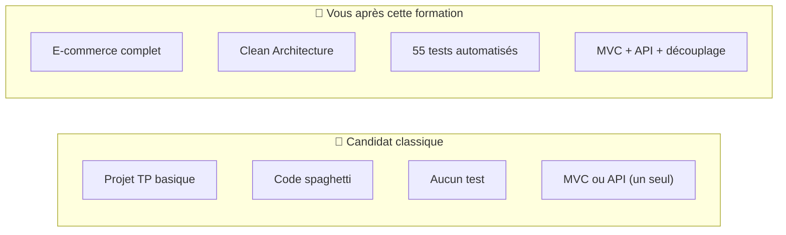
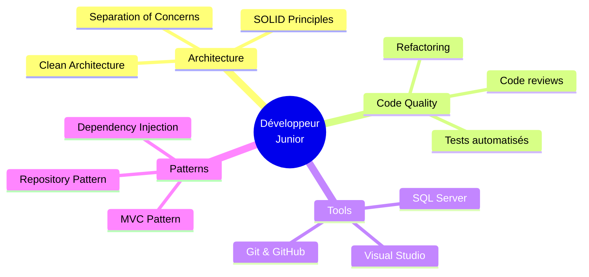
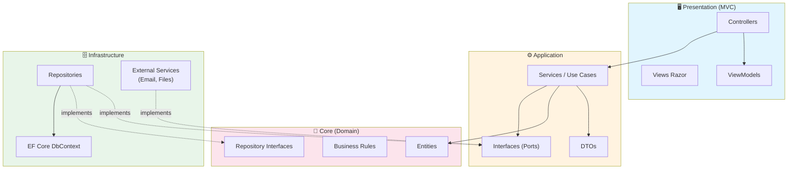
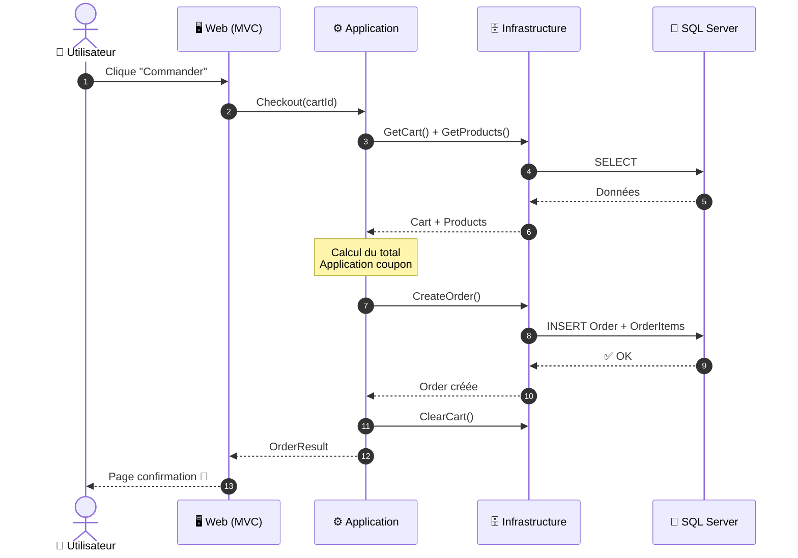
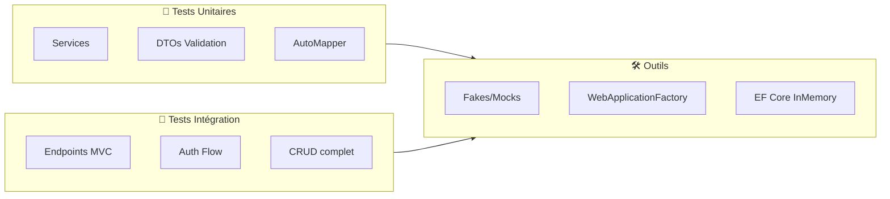
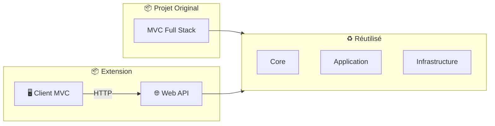

# 🛒 Projet de Formation — E‑Commerce Full Stack (ASP.NET Core MVC) avec Clean Architecture

<div align="center">


**Application e-commerce complète construite avec Clean Architecture**

[🚀 Démarrage rapide](#lancer-le-projet-en-local) • [📖 Architecture](#architecture-clean-architecture) • [🧪 Tests](#tests-unitaires-et-intégration) • [📚 Extension API](#extension-vers-api--client-mvc)

</div>

---

## 📋 Sommaire
- [🎯 Objectif](#-objectif)
- [🎓 Préparation aux entretiens techniques Junior .NET](#-préparation-aux-entretiens-techniques-junior-net)
- [💡 Valeur ajoutée pour un développeur junior](#-valeur-ajoutée-pour-un-développeur-junior)
- [✨ Fonctionnalités](#-fonctionnalités)
- [🏗️ Architecture (Clean Architecture)](#-architecture-clean-architecture)
- [📁 Structure du repository](#-structure-du-repository)
- [🛠️ Stack technique](#️-stack-technique)
- [🚀 Lancer le projet en local](#-lancer-le-projet-en-local)
- [🧪 Tests (unitaires et intégration)](#-tests-unitaires-et-intégration)
- [📚 Extension vers API + Client MVC](#-extension-vers-api--client-mvc)
- [📝 Licence / Usage](#-licence--usage)

---

## 🎯 Objectif

Ce projet est le livrable d'une formation .NET visant à construire une application **Full Stack** en **ASP.NET Core MVC** (UI + logique applicative + accès aux données), structurée selon les principes de la **Clean Architecture**.

> [!IMPORTANT]
> La partie **front MVC (Razor)** est un point clé de la formation : **toute la partie Front-End est construite de 0** pour assurer une compréhension totale des mécanismes (Controllers, Views, UI/UX, validation).

### L'objectif pédagogique est double :
1. **Comprendre** comment construire une application web MVC complète (UI, authentification, CRUD, panier, commandes)
2. **Apprendre à structurer** le code pour le rendre **maintenable**, **testable**, et **évolutif** (niveau "pro")

---

## 🎓 Préparation aux entretiens techniques Junior .NET

> [!TIP]
> **Cette formation est spécialement conçue pour les jeunes diplômés** souhaitant se préparer aux entretiens techniques pour des postes de **développeur .NET Junior**.

### 🎯 Objectif : Être prêt pour le marché du travail

Après avoir suivi cette formation, vous serez capable de :

| Question type d'entretien | Vous saurez répondre |
|---------------------------|:--------------------:|
| "Expliquez-moi la différence entre MVC et API" | ✅ |
| "Qu'est-ce que l'injection de dépendances ?" | ✅ |
| "Comment gérez-vous l'authentification ?" | ✅ |
| "Avez-vous déjà utilisé Entity Framework ?" | ✅ |
| "Avez-vous écrit des tests automatisés ?" | ✅ |
| "Montrez-moi un projet concret que vous avez réalisé" | ✅ |

### 💼 Ce qui vous distinguera des autres candidats



### 🏆 Vos arguments en entretien

1. **Un projet concret à présenter**
   > "J'ai construit une application e-commerce complète avec Clean Architecture, puis je l'ai refactorisée en API + Client MVC pour démontrer la réutilisabilité du code"

2. **Une compréhension de l'architecture**
   > "Je peux expliquer pourquoi la couche Core ne dépend de rien, et comment on peut remplacer la présentation sans toucher au métier"

3. **L'expérience des tests**
   > "J'ai écrit des tests unitaires avec des fakes et des tests d'intégration avec WebApplicationFactory"

### 📊 Niveau estimé après la formation

```
|---------|---------|---------|---------|---------|---------|
 Stagiaire  Junior    Junior+   Inter.    Senior    Expert
                        ↑
                 Votre niveau
```

> [!NOTE]
> **Salaire indicatif (France)** :
> - Paris : 35-42k€ brut/an
> - Province : 30-38k€ brut/an

---

## 💡 Valeur ajoutée pour un développeur junior

Ce projet est conçu pour accélérer la montée en compétence sur des sujets **indispensables en entreprise**.

### Compétences techniques développées

| Domaine | Technologies / Concepts |
|---------|------------------------|
| **Architecture** | Clean Architecture, séparation en couches, DI |
| **Web MVC** | Controllers, Views, Model Binding, Validation |
| **Données** | Entity Framework Core, DbContext, Migrations, LINQ |
| **Sécurité** | ASP.NET Core Identity, Rôles, `[Authorize]` |
| **Mapping** | DTOs, ViewModels, AutoMapper |
| **Qualité** | Tests unitaires, Tests d'intégration, Fakes |

### Compétences "Software Engineering"



---

## ✨ Fonctionnalités

L'application couvre un cycle e-commerce complet :

### 📦 Catalogue
| Fonctionnalité | Utilisateur | Admin |
|----------------|:-----------:|:-----:|
| Voir les produits | ✅ | ✅ |
| Détails produit | ✅ | ✅ |
| Créer/Modifier/Supprimer produit | ❌ | ✅ |
| Gérer les catégories | ❌ | ✅ |
| Gérer les coupons | ❌ | ✅ |

### 🛒 Panier & Commandes
| Fonctionnalité | Utilisateur | Admin |
|----------------|:-----------:|:-----:|
| Ajouter au panier | ✅ | ✅ |
| Modifier quantités | ✅ | ✅ |
| Appliquer coupon | ✅ | ✅ |
| Passer commande (Checkout) | ✅ | ✅ |
| Historique commandes | ✅ (ses commandes) | ✅ (toutes) |

### 🔐 Authentification
| Fonctionnalité | Description |
|----------------|-------------|
| Inscription | Avec confirmation email |
| Connexion | Cookies sécurisés |
| Mot de passe oublié | Reset via email |
| Rôles | Admin / User |

---

## 🏗️ Architecture (Clean Architecture)

Le principe central : **les règles métier ne dépendent pas de l'UI ni de la base de données**.

### Découpage en couches



### Flux utilisateur — Exemple Checkout



### Pourquoi c'est important

| Bénéfice | Description |
|----------|-------------|
| **🔄 Évolutivité** | Ajouter des fonctionnalités sans casser l'existant |
| **🧪 Testabilité** | Isoler et tester chaque couche indépendamment |
| **🔧 Maintenabilité** | Chaque couche a une responsabilité claire |
| **♻️ Réutilisabilité** | Les couches Core/Application sont réutilisables (API, CLI...) |

---

## 📁 Structure du repository

```
📁 Formation-Ecommerce/
│
├── 📁 Formation-Ecommerce/           # 🖥️ Presentation (MVC)
│   ├── Controllers/
│   │   ├── AuthController.cs                 # Authentification
│   │   ├── ProductController.cs              # Gestion produits
│   │   ├── CategoryController.cs             # Gestion catégories
│   │   ├── CouponController.cs               # Gestion coupons
│   │   ├── CartController.cs                 # Panier
│   │   ├── OrderController.cs                # Commandes
│   │   └── HomeController.cs                 # Accueil
│   ├── Views/
│   │   ├── Shared/                           # Layout, partials
│   │   ├── Product/
│   │   ├── Cart/
│   │   └── ...
│   ├── Models/                               # ViewModels
│   ├── Mapping/                              # AutoMapper profiles
│   ├── wwwroot/                              # CSS, JS, images
│   └── Program.cs                            # Configuration DI
│
├── 📁 Formation-Ecommerce.Application/ # ⚙️ Application
│   ├── Products/
│   │   ├── Services/
│   │   ├── DTOs/
│   │   └── Mapping/
│   ├── Categories/
│   ├── Cart/
│   ├── Orders/
│   └── DependencyInjection.cs                # AddApplicationRegistration()
│
├── 📁 Formation-Ecommerce.Core/        # 💎 Core (Domain)
│   ├── Entities/
│   │   ├── Product.cs
│   │   ├── Category.cs
│   │   ├── Cart.cs
│   │   ├── Order.cs
│   │   └── ApplicationUser.cs
│   ├── Interfaces/
│   │   ├── IProductRepository.cs
│   │   └── ...
│   └── Common/
│       └── BaseEntity.cs
│
├── 📁 Formation-Ecommerce.Infrastructure/ # 🗄️ Infrastructure
│   ├── Persistence/
│   │   ├── ApplicationDbContext.cs
│   │   └── Configurations/
│   ├── Repositories/
│   ├── Services/
│   │   ├── EmailSender.cs
│   │   └── FileHelper.cs
│   └── DependencyInjection.cs                # AddInfrastructureRegistration()
│
├── 📁 Formation-Ecommerce.Test/        # 🧪 Tests
│   ├── Fakes/
│   ├── Unit/
│   ├── Integration/
│   └── Common/
│
└── Formation-Ecommerce.sln
```

---

## 🛠️ Stack technique

| Catégorie | Technologies |
|-----------|--------------|
| **Framework** | .NET 8 / ASP.NET Core MVC |
| **ORM** | Entity Framework Core |
| **Base de données** | SQL Server |
| **Authentification** | ASP.NET Core Identity |
| **UI** | Razor Views, Bootstrap |
| **Mapping** | AutoMapper |
| **Tests** | xUnit, WebApplicationFactory |

---

## 🚀 Lancer le projet en local

### Pré-requis
- ✅ .NET 8 SDK
- ✅ SQL Server (LocalDB ou SQL Server)
- ✅ Visual Studio 2022+ ou VS Code

### 1. Configuration (User Secrets)

> [!CAUTION]
> **Ne jamais commiter de secrets** (mots de passe, tokens) dans Git !

```powershell
# Initialiser User Secrets
dotnet user-secrets init --project .\Formation-Ecommerce-11-2025

# Configurer la connexion SQL Server
dotnet user-secrets set "ConnectionStrings:DefaultConnection" "Server=.;Database=FormationEcommerce;Trusted_Connection=True;TrustServerCertificate=True" --project .\Formation-Ecommerce-11-2025

# Configurer l'envoi d'emails (optionnel)
dotnet user-secrets set "EmailSettings:SmtpServer" "smtp.gmail.com" --project .\Formation-Ecommerce-11-2025
dotnet user-secrets set "EmailSettings:SmtpPort" "587" --project .\Formation-Ecommerce-11-2025
dotnet user-secrets set "EmailSettings:SmtpUsername" "your-email@gmail.com" --project .\Formation-Ecommerce-11-2025
dotnet user-secrets set "EmailSettings:SmtpPassword" "your-app-password" --project .\Formation-Ecommerce-11-2025
```

### 2. Base de données

```powershell
# Appliquer les migrations EF Core
dotnet ef database update --project .\Formation-Ecommerce-11-2025.Infrastructure --startup-project .\Formation-Ecommerce-11-2025
```

### 3. Lancement

```powershell
# Via CLI
dotnet run --project .\Formation-Ecommerce-11-2025

# Ou via Visual Studio : F5
```

L'application sera accessible sur : **https://localhost:5001** (ou le port configuré)

---

## 🧪 Tests (unitaires et intégration)

Le projet inclut une suite de tests complète pour garantir la qualité du code.

### Organisation des tests

```
📁 Formation-Ecommerce-11-2025.Test/
├── 📁 Fakes/                    # Doublures de tests
│   ├── FakeProductRepository.cs
│   ├── FakeCategoryRepository.cs
│   └── FakeFileHelper.cs
│
├── 📁 Common/                   # Helpers partagés
│   ├── ValidationHelper.cs
│   └── TestAuthHandler.cs
│
├── 📁 Unit/                     # Tests unitaires
│   ├── ProductServicesTests.cs
│   ├── DtoValidationTests.cs
│   └── AutoMapperProfileTests.cs
│
└── 📁 Integration/              # Tests d'intégration
    ├── CustomWebApplicationFactory.cs
    ├── ProductsEndpointTests.cs
    └── AuthorizedEndpointTests.cs
```

### Exécuter les tests

```powershell
# Tous les tests
dotnet test

# Tests unitaires uniquement
dotnet test --filter "FullyQualifiedName~Unit"

# Tests d'intégration uniquement
dotnet test --filter "FullyQualifiedName~Integration"

# Test spécifique
dotnet test --filter "FullyQualifiedName~ProductServicesTests"
```

### Stratégie de tests



> [!NOTE]
> Les tests d'intégration utilisent **EF Core InMemory** pour éviter toute dépendance à SQL Server.

---

## 📚 Extension vers API + Client MVC

Ce projet dispose d'une **extension** qui démontre la puissance de la Clean Architecture en séparant l'application en :

1. **Backend API** (REST + JWT)
2. **Client MVC** (consomme l'API)



> [!TIP]
> Cette extension prouve qu'on peut **remplacer la couche Présentation** sans modifier les couches métier grâce à la Clean Architecture.
> 
> 📁 Voir : `../Projet extensions/README.md`

---

## 📝 Licence / Usage

Ce projet est destiné à un **usage pédagogique** dans le cadre de formations .NET.

---

<div align="center">

**🎓 Bonne formation !**

*Clean Architecture • ASP.NET Core MVC • Entity Framework Core*

</div>
