# 🛒 Projet de Formation — E‑Commerce Full Stack (ASP.NET Core MVC) avec Clean Architecture

<div align="center">


**Application e-commerce complète construite avec Clean Architecture**

[🚀 Démarrage rapide](#lancer-le-projet-en-local) • [📖 Architecture](#architecture-clean-architecture) • [🧪 Tests](#tests-unitaires-et-intégration) • [🐳 DevOps](#-devops-docker--azure) • [📚 Extension API](#extension-vers-api--client-mvc)

</div>

---

## 🎯 PROJET PORTFOLIO — DÉVELOPPEUR .NET JUNIOR

> **⚡ Ce projet démontre une maîtrise complète (100%) des compétences techniques requises pour un poste de Développeur .NET Junior / C# Developer / Backend Developer .NET.**

### ✅ Compétences couvertes — Checklist Entretien Technique Junior .NET

| Compétence requise pour Junior .NET | Couvert ? | Où dans le projet |
|-------------------------------------|:---------:|-------------------|
| **C# / .NET 8** | ✅ 100% | Tout le projet |
| **ASP.NET Core MVC** | ✅ 100% | Controllers, Views, Razor |
| **Entity Framework Core** | ✅ 100% | DbContext, Migrations, LINQ |
| **SQL Server** | ✅ 100% | Base de données relationnelle |
| **Clean Architecture** | ✅ 100% | Séparation Core/Application/Infrastructure |
| **Dependency Injection** | ✅ 100% | Program.cs, Services |
| **Repository Pattern** | ✅ 100% | IProductRepository, etc. |
| **SOLID Principles** | ✅ 100% | Architecture en couches |
| **ASP.NET Core Identity** | ✅ 100% | Auth, Roles, [Authorize] |
| **JWT Authentication** | ✅ 100% | API Extension |
| **REST API** | ✅ 100% | Web API Extension |
| **AutoMapper / DTOs** | ✅ 100% | Mapping, ViewModels |
| **Tests Unitaires (xUnit)** | ✅ 100% | 55 tests automatisés |
| **Tests d'Intégration** | ✅ 100% | WebApplicationFactory |
| **Git / GitHub** | ✅ 100% | Versioning, Branches |
| **Docker** | ✅ 100% | Containerisation |
| **CI/CD (GitHub Actions)** | ✅ 100% | Pipeline automatisé |
| **Azure Deployment** | ✅ 100% | App Service, Azure SQL |

### 🏷️ Mots-clés techniques (pour recruteurs et AI)

```
C# | .NET 8 | ASP.NET Core | MVC | Entity Framework Core | SQL Server | 
Clean Architecture | SOLID | Dependency Injection | Repository Pattern |
xUnit | Unit Testing | Integration Testing | REST API | JWT | OAuth |
Docker | Azure | CI/CD | GitHub Actions | Git | Visual Studio |
Junior Developer | Backend Developer | Full Stack Developer | 
Software Engineer | Entry-Level | Graduate Developer
```

### 💼 Ce projet est idéal pour postuler à :

- 🎯 **Développeur .NET Junior**
- 🎯 **Développeur C# Junior**
- 🎯 **Développeur Backend .NET**
- 🎯 **Développeur Full Stack .NET**
- 🎯 **Software Engineer Junior (C#/.NET)**
- 🎯 **Développeur Web ASP.NET Core**

> [!IMPORTANT]
> **Pour les recruteurs** : Ce projet représente **exactement** ce qu'un candidat junior doit maîtriser pour être opérationnel en entreprise. Il couvre **100% des compétences techniques** demandées dans les offres d'emploi pour développeur .NET junior.

---

## 🏅 Évaluation d'Expert — Suffisance Technique pour Entretien Junior .NET

> **Verdict** : Ce projet (avec [l'extension API/Client](https://github.com/Oussama-souissi024/Projet-Extensions-Formation-Ecommerce-Api-Client)) est **techniquement suffisant** pour réussir un entretien technique junior .NET.

### ✅ Couverture des compétences évaluées en entretien

| Compétence | Niveau de couverture | Verdict |
|------------|:-------------------:|---------|
| **C# / .NET 8** | ⭐⭐⭐⭐⭐ | Classes, interfaces, LINQ, async/await → OK |
| **ASP.NET Core MVC** | ⭐⭐⭐⭐⭐ | Controllers, Views, Razor, Validation → Complet |
| **Entity Framework Core** | ⭐⭐⭐⭐⭐ | DbContext, Migrations, Relations → Complet |
| **Clean Architecture** | ⭐⭐⭐⭐⭐ | Au-dessus du niveau junior attendu |
| **Dependency Injection** | ⭐⭐⭐⭐⭐ | Maîtrisé et démontré |
| **Repository Pattern** | ⭐⭐⭐⭐⭐ | Implémentation propre |
| **ASP.NET Core Identity** | ⭐⭐⭐⭐⭐ | Auth, Roles, [Authorize] → Complet |
| **REST API** | ⭐⭐⭐⭐⭐ | Web API + Swagger + JWT (Extension) |
| **Tests automatisés** | ⭐⭐⭐⭐⭐ | 55 tests (unitaires + intégration) |
| **Docker + CI/CD** | ⭐⭐⭐⭐ | Containerisation + GitHub Actions → Azure |

### 🎓 Ce qui impressionnera les recruteurs

1. **L'extension API + Client** prouve la compréhension de la Clean Architecture
2. **55 tests automatisés** → très rare chez les juniors
3. **DevOps (Docker + Azure)** → bonus significatif
4. **Projet complet end-to-end** → pas juste un TP scolaire

### 📊 Taux de réussite estimé en entretien technique

```
┌──────────────────────────────────────────────────────────────┐
│ Entretien technique Junior .NET                              │
│                                                              │
│ ████████████████████████████████████████░░░░░░░░░░ 80-85%   │
│                                                              │
│ Avec préparation algo + SQL : ██████████████████████ 90%+   │
└──────────────────────────────────────────────────────────────┘
```

> [!NOTE]
> **Conclusion** : Un candidat qui maîtrise ces projets et peut les expliquer en entretien a **toutes les chances de décrocher un poste junior .NET**. Ce portfolio est **supérieur à la moyenne** des candidats juniors.

---

## 📋 Sommaire
- [🎯 Objectif](#-objectif)
- [🎓 Préparation aux entretiens techniques Junior .NET](#-préparation-aux-entretiens-techniques-junior-net)
- [💡 Valeur ajoutée pour un développeur junior](#-valeur-ajoutée-pour-un-développeur-junior)
- [✨ Fonctionnalités](#-fonctionnalités)
- [🏗️ Architecture (Clean Architecture)](#-architecture-clean-architecture)
- [📁 Structure du repository](#-structure-du-repository)
- [🛠️ Stack technique](#️-stack-technique)
- [🚀 Lancer le projet en local](#-lancer-le-projet-en-local)
- [🐳 DevOps (Docker + Azure)](#-devops-docker--azure)
- [🧪 Tests (unitaires et intégration)](#-tests-unitaires-et-intégration)
- [📚 Extension vers API + Client MVC](#-extension-vers-api--client-mvc)
- [📝 Licence / Usage](#-licence--usage)

---

## 🎯 Objectif

Ce projet est le livrable d'une formation .NET visant à construire une application **Full Stack** en **ASP.NET Core MVC** (UI + logique applicative + accès aux données), structurée selon les principes de la **Clean Architecture**.

> [!IMPORTANT]
> La partie **front MVC (Razor)** est un point clé de la formation : **toute la partie Front-End est construite de 0** pour assurer une compréhension totale des mécanismes (Controllers, Views, UI/UX, validation).

### L'objectif pédagogique est double :
1. **Comprendre** comment construire une application web MVC complète (UI, authentification, CRUD, panier, commandes)
2. **Apprendre à structurer** le code pour le rendre **maintenable**, **testable**, et **évolutif** (niveau "pro")

---

## 🎓 Préparation aux entretiens techniques Junior .NET

> [!TIP]
> **Cette formation est spécialement conçue pour les jeunes diplômés** souhaitant se préparer aux entretiens techniques pour des postes de **développeur .NET Junior**.

### 🎯 Objectif : Être prêt pour le marché du travail

Après avoir suivi cette formation, vous serez capable de :

| Question type d'entretien | Vous saurez répondre |
|---------------------------|:--------------------:|
| "Expliquez-moi la différence entre MVC et API" | ✅ |
| "Qu'est-ce que l'injection de dépendances ?" | ✅ |
| "Comment gérez-vous l'authentification ?" | ✅ |
| "Avez-vous déjà utilisé Entity Framework ?" | ✅ |
| "Avez-vous écrit des tests automatisés ?" | ✅ |
| "Montrez-moi un projet concret que vous avez réalisé" | ✅ |

### 💼 Ce qui vous distinguera des autres candidats

```mermaid
flowchart LR
    subgraph Candidat["👤 Candidat classique"]
        A1["Projet TP basique"]
        A2["Code spaghetti"]
        A3["Aucun test"]
        A4["MVC ou API (un seul)"]
    end
    
    subgraph Vous["🌟 Vous après cette formation"]
        B1["E-commerce complet"]
        B2["Clean Architecture"]
        B3["55 tests automatisés"]
        B4["MVC + API + découplage"]
    end
```



### 🏆 Vos arguments en entretien

1. **Un projet concret à présenter**
   > "J'ai construit une application e-commerce complète avec Clean Architecture, puis je l'ai refactorisée en API + Client MVC pour démontrer la réutilisabilité du code"

2. **Une compréhension de l'architecture**
   > "Je peux expliquer pourquoi la couche Core ne dépend de rien, et comment on peut remplacer la présentation sans toucher au métier"

3. **L'expérience des tests**
   > "J'ai écrit des tests unitaires avec des fakes et des tests d'intégration avec WebApplicationFactory"

### 📊 Niveau estimé après la formation

```
|---------|---------|---------|---------|---------|---------|
 Stagiaire  Junior    Junior+   Inter.    Senior    Expert
                        ↑
                 Votre niveau
```


## 💡 Valeur ajoutée pour un développeur junior

Ce projet est conçu pour accélérer la montée en compétence sur des sujets **indispensables en entreprise**.

### Compétences techniques développées

| Domaine | Technologies / Concepts |
|---------|------------------------|
| **Architecture** | Clean Architecture, séparation en couches, DI |
| **Web MVC** | Controllers, Views, Model Binding, Validation |
| **Données** | Entity Framework Core, DbContext, Migrations, LINQ |
| **Sécurité** | ASP.NET Core Identity, Rôles, `[Authorize]` |
| **Mapping** | DTOs, ViewModels, AutoMapper |
| **Qualité** | Tests unitaires, Tests d'intégration, Fakes |

### Compétences "Software Engineering"

```mermaid
mindmap
  root((Développeur<br/>Junior))
    Architecture
      Clean Architecture
      Separation of Concerns
      SOLID Principles
    Code Quality
      Tests automatisés
      Refactoring
      Code reviews
    Tools
      Git & GitHub
      Visual Studio
      SQL Server
    Patterns
      Repository Pattern
      Dependency Injection
      MVC Pattern
```



---

## ✨ Fonctionnalités

L'application couvre un cycle e-commerce complet :

### 📦 Catalogue
| Fonctionnalité | Utilisateur | Admin |
|----------------|:-----------:|:-----:|
| Voir les produits | ✅ | ✅ |
| Détails produit | ✅ | ✅ |
| Créer/Modifier/Supprimer produit | ❌ | ✅ |
| Gérer les catégories | ❌ | ✅ |
| Gérer les coupons | ❌ | ✅ |

### 🛒 Panier & Commandes
| Fonctionnalité | Utilisateur | Admin |
|----------------|:-----------:|:-----:|
| Ajouter au panier | ✅ | ✅ |
| Modifier quantités | ✅ | ✅ |
| Appliquer coupon | ✅ | ✅ |
| Passer commande (Checkout) | ✅ | ✅ |
| Historique commandes | ✅ (ses commandes) | ✅ (toutes) |

### 🔐 Authentification
| Fonctionnalité | Description |
|----------------|-------------|
| Inscription | Avec confirmation email |
| Connexion | Cookies sécurisés |
| Mot de passe oublié | Reset via email |
| Rôles | Admin / User |

---

## 🏗️ Architecture (Clean Architecture)

Le principe central : **les règles métier ne dépendent pas de l'UI ni de la base de données**.

### Découpage en couches


### Flux utilisateur — Exemple Checkout

```mermaid
sequenceDiagram
    autonumber
    actor U as 👤 Utilisateur
    participant W as 🖥️ Web (MVC)
    participant A as ⚙️ Application
    participant I as 🗄️ Infrastructure
    participant D as 💾 SQL Server

    U->>W: Clique "Commander"
    W->>A: Checkout(cartId)
    A->>I: GetCart() + GetProducts()
    I->>D: SELECT
    D-->>I: Données
    I-->>A: Cart + Products
    
    Note over A: Calcul du total<br/>Application coupon
    
    A->>I: CreateOrder()
    I->>D: INSERT Order + OrderItems
    D-->>I: ✅ OK
    I-->>A: Order créée
    A->>I: ClearCart()
    A-->>W: OrderResult
    W-->>U: Page confirmation 🎉
```



### Pourquoi c'est important

| Bénéfice | Description |
|----------|-------------|
| **🔄 Évolutivité** | Ajouter des fonctionnalités sans casser l'existant |
| **🧪 Testabilité** | Isoler et tester chaque couche indépendamment |
| **🔧 Maintenabilité** | Chaque couche a une responsabilité claire |
| **♻️ Réutilisabilité** | Les couches Core/Application sont réutilisables (API, CLI...) |

---

## 📁 Structure du repository

```
📁 Formation-Ecommerce/
│
├── 📁 Formation-Ecommerce/           # 🖥️ Presentation (MVC)
│   ├── Controllers/
│   │   ├── AuthController.cs                 # Authentification
│   │   ├── ProductController.cs              # Gestion produits
│   │   ├── CategoryController.cs             # Gestion catégories
│   │   ├── CouponController.cs               # Gestion coupons
│   │   ├── CartController.cs                 # Panier
│   │   ├── OrderController.cs                # Commandes
│   │   └── HomeController.cs                 # Accueil
│   ├── Views/
│   │   ├── Shared/                           # Layout, partials
│   │   ├── Product/
│   │   ├── Cart/
│   │   └── ...
│   ├── Models/                               # ViewModels
│   ├── Mapping/                              # AutoMapper profiles
│   ├── wwwroot/                              # CSS, JS, images
│   └── Program.cs                            # Configuration DI
│
├── 📁 Formation-Ecommerce.Application/ # ⚙️ Application
│   ├── Products/
│   │   ├── Services/
│   │   ├── DTOs/
│   │   └── Mapping/
│   ├── Categories/
│   ├── Cart/
│   ├── Orders/
│   └── DependencyInjection.cs                # AddApplicationRegistration()
│
├── 📁 Formation-Ecommerce.Core/        # 💎 Core (Domain)
│   ├── Entities/
│   │   ├── Product.cs
│   │   ├── Category.cs
│   │   ├── Cart.cs
│   │   ├── Order.cs
│   │   └── ApplicationUser.cs
│   ├── Interfaces/
│   │   ├── IProductRepository.cs
│   │   └── ...
│   └── Common/
│       └── BaseEntity.cs
│
├── 📁 Formation-Ecommerce.Infrastructure/ # 🗄️ Infrastructure
│   ├── Persistence/
│   │   ├── ApplicationDbContext.cs
│   │   └── Configurations/
│   ├── Repositories/
│   ├── Services/
│   │   ├── EmailSender.cs
│   │   └── FileHelper.cs
│   └── DependencyInjection.cs                # AddInfrastructureRegistration()
│
├── 📁 Formation-Ecommerce.Test/        # 🧪 Tests
│   ├── Fakes/
│   ├── Unit/
│   ├── Integration/
│   └── Common/
│
└── Formation-Ecommerce.sln
```

---

## 🛠️ Stack technique

| Catégorie | Technologies |
|-----------|--------------|
| **Framework** | .NET 8 / ASP.NET Core MVC |
| **ORM** | Entity Framework Core |
| **Base de données** | SQL Server |
| **Authentification** | ASP.NET Core Identity |
| **UI** | Razor Views, Bootstrap |
| **Mapping** | AutoMapper |
| **Tests** | xUnit, WebApplicationFactory |

---

## 🚀 Lancer le projet en local

### Pré-requis
- ✅ .NET 8 SDK
- ✅ SQL Server (LocalDB ou SQL Server)
- ✅ Visual Studio 2022+ ou VS Code

### 1. Configuration (User Secrets)

> [!CAUTION]
> **Ne jamais commiter de secrets** (mots de passe, tokens) dans Git !

```powershell
# Initialiser User Secrets
dotnet user-secrets init --project .\Formation-Ecommerce-11-2025

# Configurer la connexion SQL Server
dotnet user-secrets set "ConnectionStrings:DefaultConnection" "Server=.;Database=FormationEcommerce;Trusted_Connection=True;TrustServerCertificate=True" --project .\Formation-Ecommerce-11-2025

# Configurer l'envoi d'emails (optionnel)
dotnet user-secrets set "EmailSettings:SmtpServer" "smtp.gmail.com" --project .\Formation-Ecommerce-11-2025
dotnet user-secrets set "EmailSettings:SmtpPort" "587" --project .\Formation-Ecommerce-11-2025
dotnet user-secrets set "EmailSettings:SmtpUsername" "your-email@gmail.com" --project .\Formation-Ecommerce-11-2025
dotnet user-secrets set "EmailSettings:SmtpPassword" "your-app-password" --project .\Formation-Ecommerce-11-2025
```

### 2. Base de données

```powershell
# Appliquer les migrations EF Core
dotnet ef database update --project .\Formation-Ecommerce-11-2025.Infrastructure --startup-project .\Formation-Ecommerce-11-2025
```

### 3. Lancement

```powershell
# Via CLI
dotnet run --project .\Formation-Ecommerce-11-2025

# Ou via Visual Studio : F5
```

L'application sera accessible sur : **https://localhost:5001** (ou le port configuré)

---

## 🐳 DevOps (Docker + Azure)

> [!NOTE]
> Cette section couvre la **containerisation** et le **déploiement Cloud** de l'application, compétences essentielles pour un développeur moderne.

### 🎯 Objectifs DevOps

| Compétence | Technologies |
|------------|--------------|
| **Containerisation** | Docker, Docker Compose |
| **Registry** | Azure Container Registry (ACR) |
| **Base de données Cloud** | Azure SQL Database |
| **Hébergement** | Azure App Service |
| **CI/CD** | GitHub Actions |
| **Monitoring** | Application Insights |

### 📊 Architecture de déploiement

```mermaid
flowchart TB
    subgraph Dev["💻 Développement Local"]
        Code["📝 Code Source"]
        Docker["🐳 Docker Compose"]
        LocalSQL["🗄️ SQL Server (container)"]
    end

    subgraph GitHub["📦 GitHub"]
        Repo["Repository"]
        Actions["⚙️ GitHub Actions"]
    end

    subgraph Azure["☁️ Azure"]
        ACR["📦 Container Registry"]
        AppService["🌐 App Service"]
        AzureSQL["🗄️ Azure SQL Database"]
        Insights["📊 Application Insights"]
    end

    Code -->|git push| Repo
    Repo -->|trigger| Actions
    Actions -->|build & push| ACR
    Actions -->|deploy| AppService
    ACR -->|pull image| AppService
    AppService -->|connect| AzureSQL
    AppService -->|logs| Insights
    
    Docker --> LocalSQL
    
    style Dev fill:#e3f2fd
    style GitHub fill:#fff3e0
    style Azure fill:#e8f5e9
```



### 🐳 Docker — Exécution locale

#### Fichiers Docker inclus

| Fichier | Description |
|---------|-------------|
| `Dockerfile` | Build multi-stage optimisé (.NET 8) |
| `.dockerignore` | Exclusion des fichiers inutiles |
| `docker-compose.yml` | Stack complète (App + SQL Server) |

#### Lancer avec Docker Compose

```powershell
# Démarrer les conteneurs (app + SQL Server)
docker-compose up -d

# Vérifier les logs
docker-compose logs -f web

# Arrêter les conteneurs
docker-compose down
```

L'application sera accessible sur : **http://localhost:8080**

#### Structure du Dockerfile (Multi-stage)

```mermaid
flowchart LR
    subgraph Stage1["📦 Stage 1: Build"]
        SDK["SDK .NET 8"]
        Restore["dotnet restore"]
        Build["dotnet build"]
    end
    
    subgraph Stage2["📦 Stage 2: Publish"]
        Publish["dotnet publish"]
    end
    
    subgraph Stage3["🚀 Stage 3: Runtime"]
        Runtime["ASP.NET Runtime"]
        App["Application"]
    end
    
    Stage1 --> Stage2 --> Stage3
    
    style Stage1 fill:#e3f2fd
    style Stage2 fill:#fff3e0
    style Stage3 fill:#c8e6c9
```



> [!TIP]
> Le build multi-stage réduit la taille de l'image finale (~373MB) en n'incluant que le runtime, pas le SDK.

### ☁️ Azure — Déploiement Cloud

#### Ressources Azure requises


#### Commandes de création (Azure CLI)

```powershell
# 1. Créer le Resource Group
az group create --name rg-formation-ecommerce --location francecentral

# 2. Créer Azure Container Registry
az acr create --resource-group rg-formation-ecommerce --name acrformationecommerce --sku Basic

# 3. Créer SQL Server + Database
az sql server create --name sql-formation-ecommerce --resource-group rg-formation-ecommerce --location francecentral --admin-user sqladmin --admin-password "VotreMotDePasse@123"

az sql db create --resource-group rg-formation-ecommerce --server sql-formation-ecommerce --name FormationEcommerceDb --edition Basic

# 4. Créer App Service
az appservice plan create --name asp-formation-ecommerce --resource-group rg-formation-ecommerce --sku B1 --is-linux

az webapp create --resource-group rg-formation-ecommerce --plan asp-formation-ecommerce --name formation-ecommerce-app --deployment-container-image-name acrformationecommerce.azurecr.io/formation-ecommerce:latest
```

### 🔄 CI/CD — GitHub Actions

Le pipeline automatise : **Build → Tests → Docker → Deploy**

```mermaid
flowchart LR
    subgraph Trigger["🎯 Trigger"]
        Push["git push main"]
        PR["Pull Request"]
    end
    
    subgraph Pipeline["⚙️ Pipeline"]
        Build["🔨 Build & Test"]
        Docker["🐳 Docker Build"]
        Push2["📤 Push to ACR"]
        Deploy["🚀 Deploy"]
    end
    
    subgraph Result["✅ Résultat"]
        Live["🌐 App en production"]
    end
    
    Trigger --> Build --> Docker --> Push2 --> Deploy --> Live
```



#### Workflow GitHub Actions

Le fichier `.github/workflows/azure-deploy.yml` exécute :

| Job | Description | Condition |
|-----|-------------|-----------|
| `build-and-test` | Compile et exécute les tests | Tous les push/PR |
| `docker-build-push` | Build l'image et push vers ACR | Seulement `main` |
| `deploy` | Déploie vers Azure App Service | Seulement `main` |

#### Configuration requise

1. **Créer un Service Principal Azure** :
```powershell
az ad sp create-for-rbac --name "sp-formation-github" --role contributor --scopes /subscriptions/<ID>/resourceGroups/rg-formation-ecommerce --json-auth
```

2. **Ajouter le secret GitHub** : `Settings → Secrets → AZURE_CREDENTIALS`

### 💰 Estimation des coûts

| Service | SKU | Coût/mois |
|---------|-----|-----------|
| App Service | B1 | ~13€ |
| Azure SQL | Basic | ~5€ |
| Container Registry | Basic | ~5€ |
| Application Insights | Free tier | 0€ |
| **Total** | | **~23€** |

> [!TIP]
> Utilisez **Azure for Students** (100€ de crédits gratuits) ou arrêtez les ressources après la formation.

### 📚 Guide détaillé

Pour un guide pas-à-pas complet avec toutes les commandes et configurations :

📁 **Voir : [Deploiment.md](./Deploiment.md)**

---

## 🧪 Tests (unitaires et intégration)

Le projet inclut une suite de tests complète pour garantir la qualité du code.

### Organisation des tests

```
📁 Formation-Ecommerce-11-2025.Test/
├── 📁 Fakes/                    # Doublures de tests
│   ├── FakeProductRepository.cs
│   ├── FakeCategoryRepository.cs
│   └── FakeFileHelper.cs
│
├── 📁 Common/                   # Helpers partagés
│   ├── ValidationHelper.cs
│   └── TestAuthHandler.cs
│
├── 📁 Unit/                     # Tests unitaires
│   ├── ProductServicesTests.cs
│   ├── DtoValidationTests.cs
│   └── AutoMapperProfileTests.cs
│
└── 📁 Integration/              # Tests d'intégration
    ├── CustomWebApplicationFactory.cs
    ├── ProductsEndpointTests.cs
    └── AuthorizedEndpointTests.cs
```

### Exécuter les tests

```powershell
# Tous les tests
dotnet test

# Tests unitaires uniquement
dotnet test --filter "FullyQualifiedName~Unit"

# Tests d'intégration uniquement
dotnet test --filter "FullyQualifiedName~Integration"

# Test spécifique
dotnet test --filter "FullyQualifiedName~ProductServicesTests"
```

### Stratégie de tests


> [!NOTE]
> Les tests d'intégration utilisent **EF Core InMemory** pour éviter toute dépendance à SQL Server.

---

## 📚 Extension vers API + Client MVC

Ce projet dispose d'une **extension** qui démontre la puissance de la Clean Architecture en séparant l'application en :

1. **Backend API** (REST + JWT)
2. **Client MVC** (consomme l'API)

```mermaid
flowchart LR
    subgraph Original["📦 Projet Original"]
        MVC["MVC Full Stack"]
    end
    
    subgraph Extension["📦 Extension"]
        API["🌐 Web API"]
        Client["🖥️ Client MVC"]
    end
    
    subgraph Shared["♻️ Réutilisé"]
        Core["Core"]
        App["Application"]
        Infra["Infrastructure"]
    end
    
    MVC --> Shared
    API --> Shared
    Client -->|HTTP| API
```



> [!TIP]
> Cette extension prouve qu'on peut **remplacer la couche Présentation** sans modifier les couches métier grâce à la Clean Architecture.
> 
> 📁 Voir : `../Projet extensions/README.md`

---

## 📝 Licence / Usage

Ce projet est destiné à un **usage pédagogique** dans le cadre de formations .NET.

---

<div align="center">

**🎓 Bonne formation !**

*Clean Architecture • ASP.NET Core MVC • Entity Framework Core*

</div>
